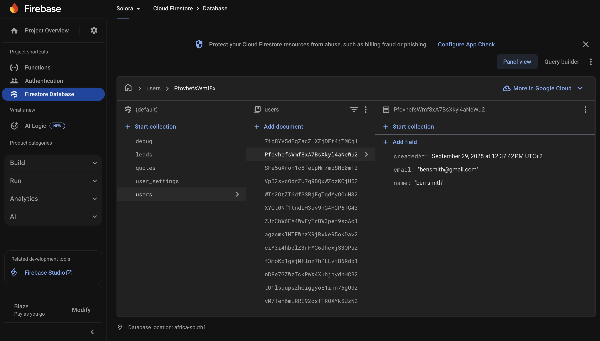
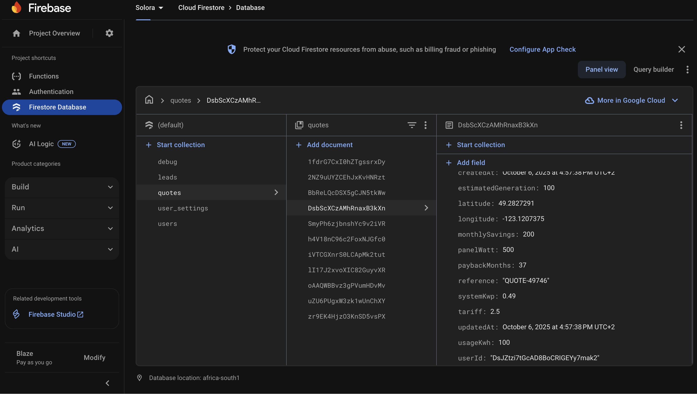
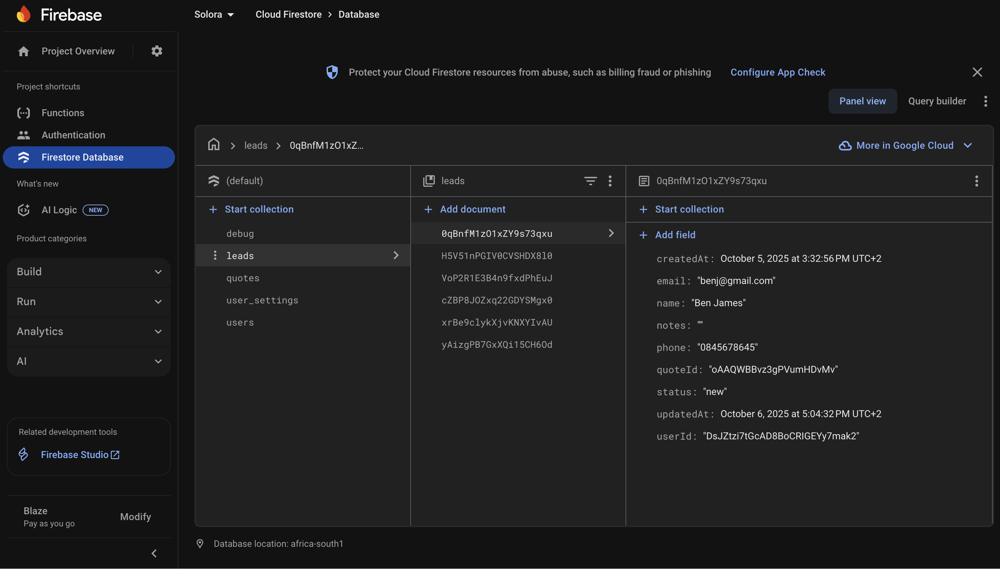

# Solora

<p align="center">
  
</p>

Solora is a Kotlin Android app for solar sales consultants to calculate system sizes, generate quotes, and manage leads. It integrates with Firebase (Auth, Firestore, Analytics, Callable Functions) and a lightweight backend implemented as Firebase Cloud Functions. The app supports offline Firestore persistence, PDF generation, and Google Sign-In.

### YouTube video showcasing the Solora app:
https://youtu.be/wNVhsIj4Qn4?si=T80afQpQ41UrxHtV

### Key Highlights
- **Quote calculator** with optional NASA POWER irradiance inputs (via Cloud Function)
- **Lead management** with search/filter and real-time updates
- **User profile & settings** synced via Functions and Firestore
- **Cloud Functions API** for secure operations and server-side logic
- **Offline support** for Firestore
- **PDF generation** (iText) and file sharing via `FileProvider`
- **Google and Email/Password authentication**


## Table of Contents
- [Features](#features)
- [Architecture Overview](#architecture-overview)
- [Tech Stack and Libraries](#tech-stack-and-libraries)
- [Cloud Functions API (Callable Endpoints)](#cloud-functions-api-callable-endpoints)
- [Data Models](#data-models-firestore)
- [App Navigation and Screens](#app-navigation-and-screens)
- [Permissions](#permissions)
- [Setup and Installation](#setup-and-installation)
  - [Prerequisites](#prerequisites)
  - [Android App Setup and Run](#android-app-setup-and-run)
  - [Firebase Project Setup](#firebase-project-setup)
  - [Cloud Functions: Develop, Emulate, Deploy](#cloud-functions-develop-emulate-deploy)
  - [Testing and CI/CD](#testing-and-cicd)
- [Troubleshooting](#troubleshooting)
- [Project Structure](#project-structure-high-level)
- [Comprehensive Project Report](#comprehensive-project-report)
  - [Purpose of the Application](#purpose-of-the-application)
  - [Design Considerations](#design-considerations)
  - [GitHub and GitHub Actions Utilization](#github-and-github-actions-utilization)
- [References](#references)
- [License](#license)


## Features
- **Quotes**
  - Create and update quotes with client, address, tariff, panel size, etc.
  - Calculate system size, estimated generation, monthly savings, and payback period.
  - Optionally fetch NASA solar irradiance and derive average sun-hours.
  - List/search previous quotes; open quote details.
<p align="center">
  
  
  
  
  
</p>

- **Leads**
  - Create, update, and list leads linked to the authenticated consultant.
  - Search by name/email/phone and filter by status.
<p align="center">
  
  
  
</p>

- **User Profile & Settings**
  - Register/login (email/password and Google Sign-In).
  - Store and sync user/company info used to enrich saved quotes.
<p align="center">
  
  
  
  
</p>

- **PDF Generation & Sharing**
  - Generate quote PDFs (iText) and share via Android `FileProvider`.
<p align="center">
  
  
</p>

- **Dashboard & Analytics**
  - Visual dashboard with quote statistics and performance metrics.
  - Date range filtering for quotes (7 days, 30 days, 6 months).
  - Circle chart visualization of quote status distribution.

- **Offline & Sync**
  - Firestore offline persistence for quotes and leads.
  - Optional "sync" Cloud Function to merge offline data to cloud.
  - Automatic data synchronization when connectivity is restored.

- **Notifications**
  - Coming soon notification system for quote updates and reminders.


## Architecture Overview
- **Android app (Kotlin, MVVM-ish)**
  - ViewModels in `dev.solora.quotes`, `dev.solora.leads`, `dev.solora.settings` orchestrate flows.
  - `FirebaseRepository` centralizes data access to Firestore and Cloud Functions.
  - `AuthRepository` handles Firebase Auth and persists minimal user info via DataStore.
  - `FirebaseFunctionsApi` wraps callable Cloud Functions for server-side logic.
  - Navigation is fragment-based with the Android Navigation Component.

- **Backend (Firebase Cloud Functions)**
  - Node.js Functions implement callable endpoints for calculations, data access, and sync.
  - NASA POWER API consulted during quote calculation when coordinates are available.


## Tech Stack and Libraries

### Android
- Kotlin 2.0.20, AGP 8.5.2, JVM target 17, compile/target SDK 35, min SDK 24
- Firebase
  - BOM `com.google.firebase:firebase-bom:33.3.0`
  - Auth (`firebase-auth-ktx`)
  - Firestore (`firebase-firestore-ktx`)
  - Analytics (`firebase-analytics-ktx`)
  - Callable Functions (`firebase-functions-ktx:20.4.0`)
- Google Sign-In: `com.google.android.gms:play-services-auth:20.7.0`
- AndroidX
  - Core KTX, Fragment KTX
  - Navigation: `androidx.navigation:navigation-fragment-ktx` / `navigation-ui-ktx` (2.8.0)
  - Lifecycle: ViewModel/Livedata/Runtime KTX (2.8.7)
  - WorkManager: `androidx.work:work-runtime-ktx:2.9.1`
  - DataStore Preferences: `androidx.datastore:datastore-preferences{,-core}:1.1.1`
- Networking: Ktor Client (2.3.12) [core, android, logging, content-negotiation, kotlinx-json]
- Permissions helper: `com.google.accompanist:accompanist-permissions:0.36.0`
- PDF: iText 7 (note: both `8.0.5` and `7.2.5` are present)
- Material Components: `com.google.android.material:material:1.12.0`

### Cloud Functions
- Node.js 22 (see `functions/package.json`)
- `firebase-functions@^6`, `firebase-admin@^12`, `axios@^1.12`


## Cloud Functions API (Callable Endpoints)
All callable endpoints require the user to be authenticated.

- `calculateQuote(data)`
  - Input: `{ address, usageKwh?, billRands?, tariff, panelWatt, latitude?, longitude? }`
  - Output: `{ success, calculation: { panels, systemKwp, inverterKw, monthlySavings, estimatedGeneration, paybackMonths, nasaData? } }`
  - Behavior: Optionally calls NASA POWER API to compute average sun-hours.

- `saveQuote(data)`
  - Input: quote fields (reference, client details, calculations...). Server enriches with company info from `user_settings` and timestamps.
  - Output: `{ success, quoteId }`

- `getQuoteById({ quoteId })`
  - Output: `{ success, quote? }` (only if owned by current user)

- `getQuotes({ search?, limit?=50 })`
  - Output: `{ success, quotes }` filtered to current user; simple search over `reference`, `clientName`, `address`.

- `saveLead(data)`
  - Input: `{ name, email, phone, status?, notes?, quoteId? }`
  - Output: `{ success, leadId }`

- `getLeads({ search?, status?, limit?=50 })`
  - Output: `{ success, leads }` filtered to current user; optional status filter and client-side search.

- `getSettings()` / `updateSettings({ settings })`
  - Output: `{ success, settings }` / `{ success, message }`

- `syncData({ offlineData })`
  - Merges local leads/quotes/settings into cloud; returns per-collection counts and errors.

- `healthCheck` (HTTP)
  - GET returns `{ status, timestamp, service, version, endpoints[] }`

Android app integrates these via `dev.solora.api.FirebaseFunctionsApi` and `dev.solora.data.FirebaseRepository` (which also provides Firestore fallbacks and real-time listeners).


## Data Models (Firestore)
- `FirebaseQuote`: id, reference, clientName, address, usageKwh, billRands, tariff, panelWatt, lat/lon, irradiance/sun-hours, calculation outputs, company/consultant snapshot, `userId`, `createdAt`, `updatedAt`.
- `FirebaseLead`: id, name, email, phone, status, notes, `quoteId`, `userId`, timestamps.
- `FirebaseUser`: id, name, surname, email, phone?, company?, role, timestamps.


## App Navigation and Screens
- `MainActivity` hosts a fragment-based navigation flow (see `res/navigation`).
- `HomeFragment` displays counts, shortcuts, and recent quotes.
- Leads and Quotes sections have list/detail flows, backed by `LeadsViewModel` and `QuotesViewModel`.
- Settings/Profile screens manage language, company info, and account actions.


## Permissions
Declared in `AndroidManifest.xml`:
- `INTERNET` (network, Firebase, NASA API)
- `POST_NOTIFICATIONS` (optional notifications)
- `READ_EXTERNAL_STORAGE` / `WRITE_EXTERNAL_STORAGE` (PDF export on older Androids)

`FileProvider` is configured via `xml/file_paths.xml` for secure sharing of generated files (e.g., PDFs).


## Setup and Installation

### Prerequisites
- **Android Studio** (Hedgehog / Jellyfish or newer)
- **Java 17** (bundled with recent Android Studio)
- **Android SDK 35** (compile and target SDK)
- **Gradle 8.9** (included in project)
- **Node.js 22** (for Cloud Functions)
- **Firebase CLI** (latest version)
- A Firebase project with:
  - Email/Password Auth enabled
  - Google Sign-In enabled (OAuth client configured)
  - Firestore in Native mode
  - Firebase Functions enabled

### Android App Setup and Run

1) **Clone the repository:**
   ```bash
   git clone https://github.com/ST10359034/PROG7314_POE_P2_Solora.git
   cd PROG7314_POE_P2_Solora
   ```

2) **Open in Android Studio:**
   - Launch Android Studio
   - Select "Open an existing project"
   - Navigate to the cloned repository folder
   - Click "OK"

3) **Configure Firebase:**
   - Ensure `google-services.json` is present at `app/google-services.json`
   - If using your own Firebase project, download a new `google-services.json` from the Firebase Console and replace the existing file

4) **Sync Gradle:**
   - Click "Sync Now" when prompted, or
   - Go to File → Sync Project with Gradle Files
   - The app targets SDK 35 and uses Kotlin 2.0.20

5) **Run the application:**
   - **Option A (Android Studio):** Click the Run button (green play icon) or press Shift+F10
   - **Option B (Command Line):**
     ```bash
     ./gradlew :app:assembleDebug
     # Then install the generated APK from app/build/outputs/apk/debug/
     ```

6) **Sign in to the app:**
   - Use Email/Password authentication, or
   - Use Google Sign-In (if configured in your Firebase project)

**Note:** Release signing is configured in `app/build.gradle.kts` with a keystore at `app/keystore/solora-release-key.keystore`. Adjust or remove this configuration if you use your own signing setup.

### Firebase Project Setup
1) In Firebase Console, create a project (or reuse an existing one) and add an Android app with the correct `applicationId` (`dev.solora` by default).
2) Enable Auth providers (Email/Password, Google) in Authentication settings.
3) Enable Firestore (Native mode). For production queries with compound ordering/filters, you may need indexes. The app logs when an index is required; create the suggested index in the Firebase Console if you see those logs.
4) Download and place `google-services.json` into `app/`.
<p align="center">
  
  
  
  
  
  
</p>

### Cloud Functions: Develop, Emulate, Deploy
From the repo root:

Local develop with emulators:
```bash
cd functions
npm ci
npm run serve  # runs Firebase emulators for functions
```

Deploy to Firebase:
```bash
cd functions
npm ci
npm run deploy
```

Other scripts:
```bash
npm run logs   # tail function logs
npm run shell  # interactive function shell
```

Functions runtime: Node 22 (see `functions/package.json`). Ensure your Firebase CLI is up to date and that your project is selected (`firebase use`).

### Testing and CI/CD

The project includes automated testing and continuous integration:

**Unit Tests**
- Quote calculation tests (`QuoteCalculatorTest.kt`)
- Data model validation tests (`FirebaseModelsTest.kt`)
- Run tests: `./gradlew test`

**GitHub Actions CI/CD**
- Automated build and testing on pull requests
- APK generation and artifact upload
- Firebase deployment automation
- See `.github/workflows/android-ci.yml` for configuration

**Linting and Code Quality**
- Android Lint checks for code quality
- ESLint for Cloud Functions
- Automated code formatting


## Troubleshooting
- **Auth errors calling Functions**: Ensure you’re signed in before invoking callable functions. All callable endpoints require authentication.
- **Missing Firestore index**: Logs may show an index requirement for queries on `quotes` or `leads` (ordered by `createdAt` filtered by `userId`). Create the suggested index in the Firebase Console under Firestore Indexes.
- **Google Sign-In configuration**: Make sure your SHA-1/256 fingerprints and OAuth client are configured in Firebase Console for the app package `dev.solora`.
- **Duplicate iText versions**: Dependencies include `com.itextpdf:itext7-core:8.0.5` and `7.2.5`. Prefer a single aligned version to avoid conflicts.
- **Old storage permissions**: On Android 10+, consider using `MediaStore`/`scoped storage`; WRITE permission may not be necessary depending on your PDF flow.


## Project Structure (high-level)
```
app/
  src/main/java/dev/solora/
    api/               # FirebaseFunctionsApi wrapper
    auth/              # AuthRepository and auth flows
    data/              # FirebaseRepository, models
    dashboard/         # Dashboard data and ViewModel
    leads/             # Leads ViewModel
    navigation/        # Fragments and navigation glue
    pdf/               # PDF generation and file sharing
    profile/           # Profile ViewModel
    quote/             # Quote calculation and NASA API
    quotes/            # Quotes ViewModel
    settings/          # Settings repository and ViewModel
    ui/views/          # Custom UI components (CircleChartView)
    utils/             # Utility classes (ToastUtils)
    SoloraApp.kt       # App initialization (Firebase, Firestore offline)
    MainActivity.kt    # Activity host
  src/main/res/        # layouts, drawables, nav graphs, values
functions/             # Firebase Cloud Functions (Node.js)
```


## Comprehensive Project Report

### Purpose of the Application

**Solora** is a comprehensive Android application designed specifically for solar sales consultants to streamline their workflow and enhance their sales process. The application serves as a complete business solution that addresses the critical needs of solar energy professionals in the South African market.

**Primary Objectives:**
- **Quote Generation**: Provide accurate solar system calculations based on client requirements, location-specific solar irradiance data, and current electricity tariffs
- **Lead Management**: Enable consultants to efficiently track, manage, and follow up with potential clients throughout the sales pipeline
- **Professional Documentation**: Generate high-quality PDF quotes that can be shared with clients, containing detailed system specifications and cost breakdowns
- **Data Analytics**: Offer insights into sales performance through dashboard analytics and quote statistics
- **Offline Capability**: Ensure consultants can work effectively even in areas with poor internet connectivity

**Target Users:**
- Solar sales consultants and installers
- Solar energy companies and their sales teams
- Independent solar energy advisors
- Renewable energy professionals

### Design Considerations

#### **1. User Experience (UX) Design**
- **Intuitive Navigation**: Implemented bottom navigation with clear icons and labels for easy access to core features
- **Material Design**: Adopted Google's Material Design principles for consistent, modern UI components
- **Responsive Layout**: Designed to work seamlessly across different Android device sizes and orientations
- **Accessibility**: Ensured proper contrast ratios, touch targets, and screen reader compatibility

#### **2. Architecture Design**
- **MVVM Pattern**: Implemented Model-View-ViewModel architecture for clean separation of concerns
- **Repository Pattern**: Centralized data access through `FirebaseRepository` with API-first approach and Firestore fallback
- **Dependency Injection**: Used Android's built-in dependency management for loose coupling
- **Offline-First**: Designed with offline capabilities using Firestore's offline persistence

#### **3. Performance Considerations**
- **Lazy Loading**: Implemented efficient data loading with pagination and lazy initialization
- **Caching Strategy**: Used Firebase's built-in caching and local DataStore for user preferences
- **Background Processing**: Leveraged WorkManager for data synchronization tasks
- **Memory Management**: Proper lifecycle management and memory leak prevention

#### **4. Security Design**
- **Authentication**: Multi-factor authentication with Firebase Auth (Email/Password + Google SSO)
- **Data Protection**: User data isolation with proper Firebase Security Rules
- **API Security**: All Cloud Functions require authentication and implement proper authorization
- **Local Storage**: Secure storage of sensitive data using Android's encrypted preferences

#### **5. Scalability Considerations**
- **Cloud Functions**: Serverless backend that automatically scales with demand
- **Firestore**: NoSQL database that scales horizontally
- **Modular Architecture**: Feature-based package structure for easy maintenance and expansion
- **API Design**: RESTful API design with proper versioning and error handling

### GitHub and GitHub Actions Utilization

#### **1. Version Control Strategy**
- **Branch Management**: Implemented feature branch workflow with main branch protection
- **Commit Standards**: Used conventional commit messages for clear change tracking
- **Code Review Process**: Required pull request reviews before merging to main branch
- **Release Management**: Tagged releases for version tracking and deployment

#### **2. GitHub Actions CI/CD Pipeline**

**Automated Build Process:**
```yaml
# .github/workflows/android-ci.yml
name: Android CI/CD
on:
  push:
    branches: [ main, develop ]
  pull_request:
    branches: [ main ]
```

**Key Workflow Components:**
- **Environment Setup**: Automated Android SDK, Java 17, and Node.js 22 setup
- **Dependency Management**: Automatic Gradle dependency resolution and npm package installation
- **Code Quality Checks**: Automated linting, formatting, and static analysis
- **Testing**: Unit test execution with coverage reporting
- **Build Verification**: APK generation and artifact upload
- **Security Scanning**: Dependency vulnerability checks

**Benefits of GitHub Actions:**
- **Continuous Integration**: Every commit triggers automated testing and validation
- **Early Error Detection**: Issues are caught before they reach production
- **Consistent Builds**: Standardized build environment across all developers
- **Automated Deployment**: Streamlined deployment process to Firebase
- **Quality Assurance**: Automated code quality checks and security scanning

#### **3. Project Management Integration**
- **Issue Tracking**: Used GitHub Issues for bug reports and feature requests
- **Project Boards**: Organized development tasks using GitHub Projects
- **Milestone Tracking**: Set up milestones for major releases and feature completion
- **Documentation**: Maintained comprehensive documentation in the repository

#### **4. Collaboration Features**
- **Pull Request Reviews**: Mandatory code reviews for all changes
- **Discussion Forums**: Used GitHub Discussions for technical discussions
- **Wiki Documentation**: Maintained project wiki for detailed technical documentation
- **Release Notes**: Automated release note generation from commit messages

#### **5. Security and Compliance**
- **Secret Management**: Used GitHub Secrets for sensitive configuration data
- **Branch Protection**: Enforced branch protection rules for main branch
- **Dependency Updates**: Automated dependency update notifications
- **Security Alerts**: Integrated Dependabot for security vulnerability monitoring

### Technical Implementation Highlights

#### **1. Modern Android Development**
- **Kotlin 2.0.20**: Latest Kotlin features for improved developer experience
- **Android SDK 35**: Latest Android APIs and features
- **Jetpack Components**: ViewModel, LiveData, Navigation, and DataStore
- **Material Design 3**: Latest Material Design components and theming

#### **2. Cloud Integration**
- **Firebase Ecosystem**: Comprehensive use of Firebase services
- **REST API Design**: Well-structured API endpoints with proper error handling
- **Real-time Data**: Live updates using Firestore listeners
- **Offline Synchronization**: Automatic data sync when connectivity is restored

#### **3. Testing Strategy**
- **Unit Testing**: Comprehensive test coverage for business logic
- **Integration Testing**: API and database integration tests
- **UI Testing**: Automated UI testing with Espresso
- **Performance Testing**: Load testing for Cloud Functions

This comprehensive approach ensures that Solora is not just a functional application, but a robust, scalable, and maintainable solution that follows industry best practices and modern development standards.

## References

### AI Tools and Development Assistance
- **Claude AI** - Used for debugging, code suggestions, and development guidance throughout the project
- **ChatGPT** - Used for debugging, code suggestions, and development guidance throughout the project
- **Cursor IDE** - AI-powered code completion and suggestions during development
- **Quillbot AI** - AI-powered Grammar checker and paraphrasing tool
- 

### Android Development
- **Android Developer Documentation** - https://developer.android.com/
- **Kotlin Programming Language** - https://kotlinlang.org/
- **Android Jetpack Components** - https://developer.android.com/jetpack
- **Material Design Guidelines** - https://material.io/design
- **Android Navigation Component** - https://developer.android.com/guide/navigation
- **Android ViewModel and LiveData** - https://developer.android.com/topic/libraries/architecture/viewmodel
- **Kotlin Coroutines** - https://kotlinlang.org/docs/coroutines-overview.html
- **Android DataStore** - https://developer.android.com/topic/libraries/architecture/datastore

### Firebase and Backend Services
- **Firebase Documentation** - https://firebase.google.com/docs
- **Firebase Authentication** - https://firebase.google.com/docs/auth
- **Cloud Firestore** - https://firebase.google.com/docs/firestore
- **Firebase Cloud Functions** - https://firebase.google.com/docs/functions
- **Firebase Analytics** - https://firebase.google.com/docs/analytics
- **Google Sign-In for Android** - https://developers.google.com/identity/sign-in/android

### Third-Party Libraries
- **iText PDF Library** - https://itextpdf.com/
- **Ktor HTTP Client** - https://ktor.io/docs/http-client.html
- **Material Components for Android** - https://github.com/material-components/material-components-android
- **Accompanist Permissions** - https://google.github.io/accompanist/permissions/

### External APIs
- **NASA POWER API** - https://power.larc.nasa.gov/
- **Google Geocoding API** - https://developers.google.com/maps/documentation/geocoding

### Development Tools and Resources
- **Android Studio** - https://developer.android.com/studio
- **Git Version Control** - https://git-scm.com/
- **GitHub** - https://github.com/
- **Gradle Build System** - https://gradle.org/
- **JUnit Testing Framework** - https://junit.org/junit5/
- **Mockito Testing Framework** - https://site.mockito.org/

### Project Repository
- **Solora GitHub Repository** - https://github.com/VCCT-PROG7314-2025-G2/PROG7314_POE_P2_Solora

## License
This project is for educational purposes. Review any third-party libraries' licenses (e.g., iText) before production use.


